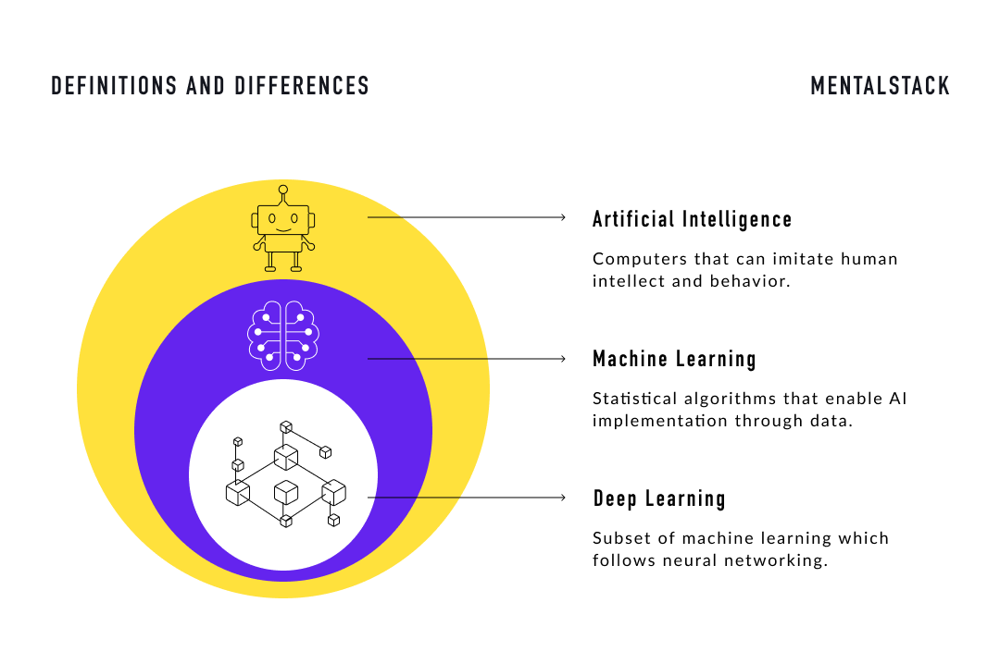

Name: Masood Ullah

# Assignment

## **Difference Between Artificial Intelligence, Machine Learning, and Deep Learning**

Artificial intelligence (AI) is a broad field that encompasses many different approaches and techniques for building intelligent systems. Machine learning (ML) and deep learning (DL) are two types of AI that are becoming increasingly popular and widely used.

Machine learning involves the use of algorithms and statistical models to enable a system to learn from data, without being explicitly programmed. The system is able to improve its performance over time as it is exposed to more data. Machine learning can be used for a wide range of tasks, including image and speech recognition, natural language processing, and predictive modeling.

Deep learning is a type of machine learning that involves the use of artificial neural networks, which are inspired by the structure and function of the human brain. Deep learning algorithms are able to learn and make decisions on their own by processing large amounts of data and learning from it. Deep learning is often used for tasks that require the ability to learn and adapt, such as image and speech recognition, natural language processing, and machine translation.

In summary, AI is the broad field of study that includes machine learning and deep learning, as well as other techniques and approaches for building intelligent systems. Machine learning involves the use of algorithms and statistical models to enable a system to learn from data, while deep learning involves the use of artificial neural networks to learn and make decisions.

